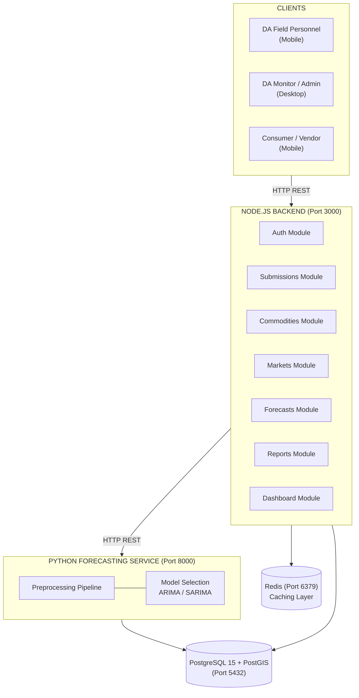
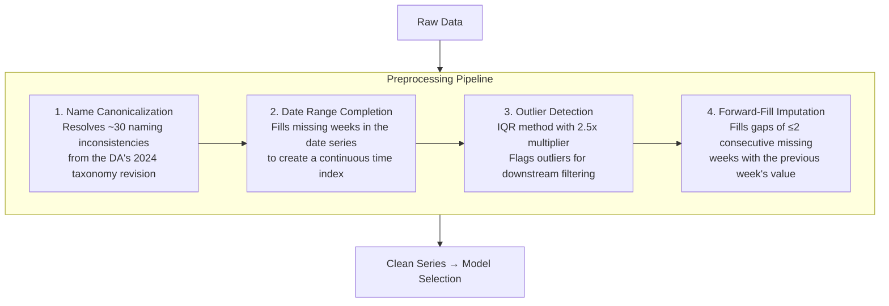
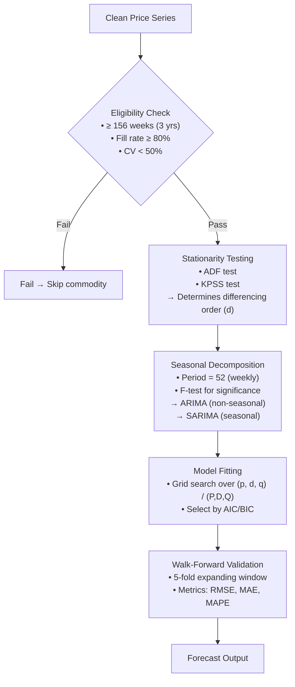

```markdown
# Agrimaps — Agricultural Market Intelligence System Backend

**Backend API, ARIMA/SARIMA Forecasting Microservice, and Database Infrastructure for NCR Public Market Commodity Price Monitoring**

Built for the research project: *"Agrimaps: Agricultural Market Intelligence System for NCR Using Geomapping, Mobile Monitoring, and Predictive Forecasting"* — José Rizal University, College of Computer Studies and Engineering, SY 2025–2026.

---

## Table of Contents

- [Overview](#overview)
- [System Architecture](#system-architecture)
- [Tech Stack](#tech-stack)
- [Prerequisites](#prerequisites)
- [Installation](#installation)
  - [1. PostgreSQL 15 + PostGIS](#1-postgresql-15--postgis)
  - [2. Redis](#2-redis)
  - [3. Node.js v20 LTS](#3-nodejs-v20-lts)
  - [4. Python 3.11+](#4-python-311)
  - [5. Git](#5-git)
- [Project Setup](#project-setup)
  - [1. Clone and Create Structure](#1-clone-and-create-structure)
  - [2. Create Database and User](#2-create-database-and-user)
  - [3. Configure Environment Variables](#3-configure-environment-variables)
  - [4. Install Backend Dependencies](#4-install-backend-dependencies)
  - [5. Install Forecasting Service Dependencies](#5-install-forecasting-service-dependencies)
  - [6. Apply Database Schema](#6-apply-database-schema)
  - [7. Seed the Database](#7-seed-the-database)
- [Running the System](#running-the-system)
  - [Terminal 1 — Forecasting Service](#terminal-1--forecasting-service)
  - [Terminal 2 — Node.js Backend](#terminal-2--nodejs-backend)
  - [Verify Services](#verify-services)
- [API Documentation](#api-documentation)
  - [Health Check](#health-check)
  - [Authentication](#authentication)
  - [Public Endpoints (No Auth)](#public-endpoints-no-auth)
  - [Authenticated Endpoints (DA Personnel)](#authenticated-endpoints-da-personnel)
  - [Test Accounts](#test-accounts)
- [Database Schema](#database-schema)
  - [Tables](#tables)
  - [Views](#views)
  - [Entity Relationship Overview](#entity-relationship-overview)
- [Forecasting Pipeline](#forecasting-pipeline)
  - [Preprocessing Pipeline](#preprocessing-pipeline)
  - [Model Selection Flow](#model-selection-flow)
  - [Forecast Output](#forecast-output)
- [Project Structure](#project-structure)
- [Configuration Reference](#configuration-reference)
- [Common Commands](#common-commands)
- [Troubleshooting](#troubleshooting)
- [Environment Variables Reference](#environment-variables-reference)
- [License](#license)
- [Authors](#authors)
- [Acknowledgments](#acknowledgments)

---

## Overview

Agrimaps is a web-based agricultural commodity price monitoring, forecasting, and geomapping decision-support system for NCR (National Capital Region) public markets. It is designed to augment the Department of Agriculture's existing Bantay Presyo program by adding:

- **ARIMA/SARIMA-based short-term price forecasting** for 38 selected commodities across 7 categories
- **Interactive WebGIS visualization** of commodity price data across 31 NCR public market locations
- **Mobile-responsive price submission** replacing the manual pen-and-paper Bantay Presyo field workflow
- **Role-differentiated dashboards** for DA monitoring personnel, market vendors, and consumers
- **Structured data quality pipeline** addressing naming inconsistencies, missing values, and outliers in Bantay Presyo historical data

This repository contains the **backend infrastructure only**: the Node.js REST API, the Python ARIMA/SARIMA forecasting microservice, the PostgreSQL database schema, and all supporting configuration.

---

## System Architecture



---

## Tech Stack

| Component              | Technology                                   |
|------------------------|----------------------------------------------|
| **Backend API**        | Node.js 20, Express.js 4                    |
| **Forecasting Service**| Python 3.11, FastAPI, statsmodels            |
| **Database**           | PostgreSQL 15, PostGIS 3                     |
| **Cache**              | Redis 7                                      |
| **Authentication**     | JWT (jsonwebtoken)                           |
| **Password Hashing**   | bcryptjs (12 rounds)                         |
| **Validation**         | Joi (backend), Pydantic (forecasting)        |
| **Forecasting Models** | ARIMA, SARIMA (statsmodels)                  |
| **Spatial**            | PostGIS (geom, GeoJSON)                      |
| **Security Headers**   | Helmet                                       |
| **Logging**            | Winston (backend), Python logging (forecasting) |
| **API Documentation**  | Auto-generated via FastAPI (Swagger UI)      |

---

## Installation & Setup

For full, cross-platform (macOS, Linux, Windows) setup instructions including the PostgreSQL Database, Bun Backend, and Python Forecasting Service, please see the dedicated **[Setup Guide](backend/README.md)**.

---

## API Documentation

### Base URL

```
http://localhost:3000/api
```

### Health Check

| Method | Endpoint       | Auth | Description             |
|--------|----------------|------|-------------------------|
| GET    | `/api/health`  | No   | Returns API health status |

### Authentication

All authenticated endpoints require a JWT token in the `Authorization` header:

```
Authorization: Bearer <token>
```

| Method | Endpoint              | Auth    | Description                |
|--------|-----------------------|---------|----------------------------|
| POST   | `/api/v1/auth/login`  | No      | Login and receive JWT      |
| GET    | `/api/v1/auth/profile`| Yes     | Get authenticated user profile |

**Login Request:**
```json
POST /api/v1/auth/login
Content-Type: application/json

{
  "employeeId": "DA-ADMIN-001",
  "password": "Admin@2025"
}
```

**Login Response:**
```json
{
  "success": true,
  "message": "Login successful",
  "data": {
    "token": "eyJhbGciOiJIUzI1NiIs...",
    "user": {
      "id": "uuid",
      "employeeId": "DA-ADMIN-001",
      "firstName": "System",
      "lastName": "Administrator",
      "email": "admin@agrimaps.da.gov.ph",
      "role": "admin"
    }
  }
}
```

### Public Endpoints (No Auth)

These endpoints are accessible to consumers and market vendors without authentication.

#### Commodities

| Method | Endpoint                                      | Description                           |
|--------|-----------------------------------------------|---------------------------------------|
| GET    | `/api/v1/public/commodities`                  | List all commodities                  |
| GET    | `/api/v1/public/commodities?category=rice`    | Filter by category                    |
| GET    | `/api/v1/public/commodities?forecastableOnly=true` | Filter forecastable commodities |
| GET    | `/api/v1/public/commodities/prices/latest`    | Latest price per commodity with trend |
| GET    | `/api/v1/public/commodities/prices/latest?category=vegetables` | Filter latest prices |
| GET    | `/api/v1/public/commodities/:id/trend`        | Price trend for a commodity           |
| GET    | `/api/v1/public/commodities/:id/trend?weeks=26` | Custom trend period               |

#### Markets

| Method | Endpoint                                  | Description                      |
|--------|-------------------------------------------|----------------------------------|
| GET    | `/api/v1/public/markets`                  | List all NCR markets             |
| GET    | `/api/v1/public/markets?city=Manila`      | Filter by city                   |
| GET    | `/api/v1/public/markets/geojson`          | GeoJSON for WebGIS rendering     |
| GET    | `/api/v1/public/markets/geojson?city=Quezon City` | Filter GeoJSON by city  |

#### Forecasts

| Method | Endpoint                                    | Description                    |
|--------|---------------------------------------------|--------------------------------|
| GET    | `/api/v1/public/forecasts`                  | Latest forecasts for all commodities |
| GET    | `/api/v1/public/forecasts?horizon=13`       | 13-week horizon forecasts      |
| GET    | `/api/v1/public/forecasts/:commodityId`     | Latest forecast for a commodity |
| GET    | `/api/v1/public/forecasts/:commodityId?horizon=13` | Custom horizon           |

#### Dashboard

| Method | Endpoint                          | Description                          |
|--------|-----------------------------------|--------------------------------------|
| GET    | `/api/v1/public/dashboard`        | Public dashboard (prices, forecasts, market count) |

### Authenticated Endpoints (DA Personnel)

All endpoints below require a valid JWT token.

#### Submissions (DA Field + Monitoring + Admin)

| Method | Endpoint                                | Role                        | Description               |
|--------|-----------------------------------------|-----------------------------|---------------------------|
| POST   | `/api/v1/submissions`                   | field, monitoring, admin    | Create a price submission |
| GET    | `/api/v1/submissions`                   | monitoring, admin           | List submissions (paginated) |
| PATCH  | `/api/v1/submissions/:id/validate`      | monitoring, admin           | Validate or reject submission |

**Create Submission Request:**
```json
POST /api/v1/submissions
Authorization: Bearer <token>
Content-Type: application/json

{
  "marketId": "uuid-of-market",
  "items": [
    { "commodityId": "uuid", "retailPrice": 55.50 },
    { "commodityId": "uuid", "retailPrice": 120.00, "notes": "Promo price" }
  ],
  "location": { "lat": 14.6042, "lng": 120.9726 },
  "deviceInfo": { "platform": "android", "version": "14" }
}
```

**Validate Submission Request:**
```json
PATCH /api/v1/submissions/:id/validate
Authorization: Bearer <token>
Content-Type: application/json

{
  "status": "validated",
  "rejectionReason": null
}
```

#### Forecast Generation (Monitoring + Admin)

| Method | Endpoint                                        | Role             | Description              |
|--------|-------------------------------------------------|------------------|--------------------------|
| POST   | `/api/v1/admin/forecasts/generate/:commodityId` | monitoring, admin| Generate forecast        |

**Request:**
```json
POST /api/v1/admin/forecasts/generate/:commodityId
Authorization: Bearer <token>
Content-Type: application/json

{
  "horizon": 4
}
```

#### Reports (Monitoring + Admin)

| Method | Endpoint                                    | Description                      |
|--------|---------------------------------------------|----------------------------------|
| GET    | `/api/v1/admin/reports/submission-progress` | Submission collection progress   |
| GET    | `/api/v1/admin/reports/submission-progress?dateFrom=2025-05-01&dateTo=2025-05-31` | Date range |
| GET    | `/api/v1/admin/reports/market-coverage`     | Market coverage report           |
| GET    | `/api/v1/admin/reports/price-trend?category=rice&weeks=12` | Price trend report  |

#### Admin Dashboard

| Method | Endpoint                    | Description                             |
|--------|-----------------------------|-----------------------------------------|
| GET    | `/api/v1/admin/dashboard`   | Admin dashboard (public data + pending submissions + today count) |

### Test Accounts

| Employee ID   | Password       | Role           | Purpose                          |
|---------------|----------------|----------------|----------------------------------|
| DA-ADMIN-001  | Admin@2025     | admin          | Full access to all endpoints     |
| DA-MON-001    | Monitor@2025   | da_monitoring  | Monitoring, reports, validation  |
| DA-FIELD-001  | Field@2025     | da_field       | Price submission only            |

**Role-based access:**

| Endpoint Group       | admin | da_monitoring | da_field |
|----------------------|-------|---------------|----------|
| Public endpoints     | Yes   | Yes           | Yes      |
| Create submission    | Yes   | Yes           | Yes      |
| List submissions     | Yes   | Yes           | No       |
| Validate submission  | Yes   | Yes           | No       |
| Generate forecast    | Yes   | Yes           | No       |
| Reports              | Yes   | Yes           | No       |
| Admin dashboard      | Yes   | Yes           | No       |

---

## Database Schema

### Tables

| Table                  | Description                                           |
|------------------------|-------------------------------------------------------|
| `users`                | DA personnel accounts (field, monitoring, admin)      |
| `markets`              | 31 NCR public markets with coordinates and PostGIS geometry |
| `commodities`          | 67 monitored commodities across 8 categories         |
| `historical_prices`    | Weekly average retail prices (2020–2025 + ongoing)    |
| `submissions`          | Field price submission headers                        |
| `submission_items`     | Individual commodity prices within a submission       |
| `forecasts`            | Generated ARIMA/SARIMA forecast results               |
| `forecast_validations` | Walk-forward validation records                       |
| `audit_logs`           | System activity audit trail                           |
| `commodity_name_map`   | Raw-to-canonical commodity name mapping               |

### Views

| View                    | Description                                          |
|-------------------------|------------------------------------------------------|
| `collection_progress`   | Submission completion percentage per market per day  |
| `market_coverage`       | Market reporting history and commodity coverage      |

### Entity Relationship Overview

```
users ──────┬──── submissions ──── submission_items ──── commodities
            │                              │
            │                              │
            └──── audit_logs          historical_prices
                                        │
                                   forecasts ──── forecast_validations
                                        │
                                   commodities
                                        │
                                   commodity_name_map

markets (standalone, referenced by submissions and historical_prices)
```

### Commodity Categories

| Category       | Count | Examples                                      |
|----------------|-------|-----------------------------------------------|
| Rice           | 4     | Regular Milled, Well Milled, Special, Sinandomeng |
| Vegetables     | 12    | Ampalaya, Cabbage, Tomato, Potato, Carrots    |
| Spices         | 4     | Red Onion, White Onion, Garlic, Ginger        |
| Fish           | 4     | Bangus, Galunggong, Tilapia, Pusit            |
| Meat & Poultry | 5     | Chicken, Pork Liempo, Pork Kasim, Beef, Egg   |
| Fruits         | 5     | Banana, Calamansi, Mango, Papaya, Watermelon  |
| Sugar & Oil    | 4     | Sugar Washed/Refined/Brown, Cooking Oil       |

---

## Forecasting Pipeline

### Preprocessing Pipeline

Raw Bantay Presyo data passes through four stages before model fitting:



### Model Selection Flow



### Forecast Output

Each forecast includes:

```json
{
  "commodity_id": "uuid",
  "commodity_name": "Rice - Well Milled",
  "model_type": "SARIMA",
  "model_parameters": {
    "order": [1, 1, 1],
    "seasonal_order": [1, 1, 1, 52],
    "aic": 452.34,
    "bic": 468.12
  },
  "forecast_values": [
    { "week": 1, "predicted_price": 48.50, "lower_ci": 45.20, "upper_ci": 51.80 },
    { "week": 2, "predicted_price": 48.75, "lower_ci": 44.90, "upper_ci": 52.60 },
    { "week": 3, "predicted_price": 49.10, "lower_ci": 44.50, "upper_ci": 53.70 },
    { "week": 4, "predicted_price": 49.30, "lower_ci": 44.10, "upper_ci": 54.50 }
  ],
  "confidence_level": 0.95,
  "metrics": {
    "rmse": 2.34,
    "mae": 1.87,
    "mape": 3.82
  },
  "is_low_confidence": false,
  "confidence_reason": null
}
```

**Low-confidence flagging** occurs when:
- Data fill rate falls below 85%
- Validation MAPE exceeds 20%

---

## Project Structure

```
agrimaps/
├── .gitignore
├── .env
├── database/
│   ├── init.sql                          # Full database schema
│   └── seed_data/
│       ├── NCR_markets.json              # 19 NCR market definitions
│       └── commodity_taxonomy.json       # 38 commodity definitions
│
├── backend/
│   ├── .env                              # Backend environment variables
│   ├── package.json                      # Node.js dependencies
│   ├── seeds/
│   │   └── run.js                        # Database seed script
│   ├── src/
│   │   ├── config/
│   │   │   ├── auth.js                   # JWT configuration
│   │   │   ├── db.js                     # PostgreSQL connection pool
│   │   │   └── env.js                    # Environment variable loader
│   │   ├── middleware/
│   │   │   ├── authMiddleware.js         # JWT verification + role guard
│   │   │   ├── errorHandler.js           # Global error handler
│   │   │   └── validateRequest.js        # Joi validation middleware
│   │   ├── modules/
│   │   │   ├── auth/
│   │   │   │   ├── authController.js
│   │   │   │   ├── authService.js
│   │   │   │   ├── authRoutes.js
│   │   │   │   └── authValidation.js
│   │   │   ├── commodities/
│   │   │   │   ├── commodityController.js
│   │   │   │   ├── commodityService.js
│   │   │   │   └── commodityRoutes.js
│   │   │   ├── dashboard/
│   │   │   │   ├── dashboardController.js
│   │   │   │   ├── dashboardService.js
│   │   │   │   └── dashboardRoutes.js
│   │   │   ├── forecasts/
│   │   │   │   ├── forecastController.js
│   │   │   │   ├── forecastService.js
│   │   │   │   └── forecastRoutes.js
│   │   │   ├── markets/
│   │   │   │   ├── marketController.js
│   │   │   │   ├── marketService.js
│   │   │   │   └── marketRoutes.js
│   │   │   ├── reports/
│   │   │   │   ├── reportController.js
│   │   │   │   ├── reportService.js
│   │   │   │   └── reportRoutes.js
│   │   │   └── submissions/
│   │   │       ├── submissionController.js
│   │   │       ├── submissionService.js
│   │   │       ├── submissionRoutes.js
│   │   │       └── submissionValidation.js
│   │   ├── utils/
│   │   │   ├── logger.js                 # Winston logger
│   │   │   └── responseFormatter.js      # Standardized API responses
│   │   ├── app.js                        # Express app configuration
│   │   └── server.js                     # Entry point
│   └── tests/
│       ├── unit/
│       └── integration/
│
└── forecasting-service/
    ├── .env                              # Forecasting environment variables
    ├── requirements.txt                  # Python dependencies
    ├── app/
    │   ├── __init__.py
    │   ├── config.py                     # Forecasting constants and DB config
    │   ├── main.py                       # FastAPI entry point
    │   ├── api/
    │   │   ├── __init__.py
    │   │   └── forecast_routes.py        # POST /api/forecast endpoint
    │   ├── models/
    │   │   ├── __init__.py
    │   │   ├── arima_model.py            # ARIMA fitting and forecasting
    │   │   ├── sarima_model.py           # SARIMA fitting and forecasting
    │   │   └── model_selector.py         # Eligibility check + model selection
    │   ├── preprocessing/
    │   │   ├── __init__.py
    │   │   ├── canonicalization.py       # Commodity name mapping
    │   │   ├── imputation.py             # Forward-fill imputation
    │   │   ├── outlier_detection.py      # IQR-based outlier flagging
    │   │   └── pipeline.py              # Unified preprocessing pipeline
    │   ├── validation/
    │   │   ├── __init__.py
    │   │   ├── seasonal_decomp.py        # Seasonal decomposition and testing
    │   │   └── stationarity.py           # ADF and KPSS stationarity tests
    │   └── utils/
    │       ├── __init__.py
    │       └── metrics.py                # RMSE, MAE, MAPE calculators
    ├── tests/
    │   └── __init__.py
    └── model_cache/                      # Cached fitted models
```

---

## Configuration Reference

### Forecasting Model Parameters

| Parameter              | Value   | Description                                              |
|------------------------|---------|----------------------------------------------------------|
| `MIN_HISTORICAL_WEEKS` | 52      | Minimum weeks of data required to attempt forecasting    |
| `MIN_FILL_RATE`        | 0.80    | Minimum data completeness (80%) for forecast eligibility |
| `MAX_CV`               | 0.50    | Maximum coefficient of variation for eligibility         |
| `MAX_IMPUTE_GAP`       | 2       | Maximum consecutive missing weeks for forward-fill       |
| `IQR_MULTIPLIER`       | 2.5     | Outlier detection threshold                              |
| `CONFIDENCE_LEVEL`     | 0.95    | Forecast confidence interval level (95%)                 |
| `HORIZON_WEEKS`        | [4, 13] | Supported forecast horizons                              |
| `ARIMA_MAX_P`          | 5       | Maximum AR lag order for ARIMA grid search               |
| `ARIMA_MAX_Q`          | 5       | Maximum MA lag order for ARIMA grid search               |
| `SARIMA_MAX_P`         | 3       | Maximum AR lag order for SARIMA grid search              |
| `SARIMA_MAX_Q`         | 3       | Maximum MA lag order for SARIMA grid search              |
| `SARIMA_MAX_P_SEAS`    | 2       | Maximum seasonal AR lag order                            |
| `SARIMA_MAX_Q_SEAS`    | 2       | Maximum seasonal MA lag order                            |
| `SEASONAL_PERIOD`      | 52      | Weekly data annual seasonality period                    |

### Node.js Backend Configuration

| Variable                 | Default              | Description                          |
|--------------------------|----------------------|--------------------------------------|
| `PORT`                   | 3000                 | Backend API port                     |
| `DATABASE_URL`           | —                    | PostgreSQL connection string         |
| `REDIS_URL`              | redis://localhost:6379 | Redis connection string            |
| `JWT_SECRET`             | —                    | Secret key for JWT signing (min 32 chars) |
| `JWT_EXPIRES_IN`         | 8h                   | JWT token expiration time            |
| `FORECASTING_SERVICE_URL`| http://localhost:8000 | Python microservice base URL        |
| `CORS_ORIGIN`            | http://localhost:5173 | Allowed CORS origins (comma-separated) |
| `LOG_LEVEL`              | info                 | Logging level (debug/info/warn/error) |

---

## Common Commands

### PostgreSQL

```bash
# Open psql shell
psql -U agrimaps_admin -d agrimaps -h localhost

# Inside psql:
\dt                                    # List all tables
\d table_name                          # Describe a table
SELECT COUNT(*) FROM commodities;      # Count records
\q                                     # Quit

# Reset database completely
dropdb -U agrimaps_admin -h localhost agrimaps
createdb -U agrimaps_admin -h localhost agrimaps
psql -U agrimaps_admin -d agrimaps -h localhost -f database/init.sql
cd backend && node seeds/run.js
```

### Redis

```bash
redis-cli ping              # Check connection (expect: PONG)
redis-cli FLUSHALL          # Clear all cached data
redis-cli INFO memory       # Check memory usage
```

### Backend (Node.js)

```bash
cd backend

npm run dev                 # Start with auto-restart (development)
npm start                   # Start without auto-restart (production)
npm test                    # Run tests with coverage
npm run seed                # Re-seed the database
```

### Forecasting Service (Python)

```bash
cd forecasting-service

# Activate virtual environment
source venv/bin/activate          # macOS/Linux
# .\venv\Scripts\activate         # Windows

uvicorn app.main:app --reload --port 8000    # Dev mode with auto-restart
uvicorn app.main:app --host 0.0.0.0 --port 8000 --workers 2  # Production

pip install package_name          # Add a new dependency
pip freeze > requirements.txt     # Save current dependencies
python -m pytest tests/           # Run tests
```

### Git

```bash
git add .
git commit -m "description of changes"
git push origin main
```

---

## Troubleshooting

### Database Connection Issues

```
Error: connect ECONNREFUSED 127.0.0.1:5432
```
**Cause:** PostgreSQL is not running.
```bash
# Windows: Open Services app → PostgreSQL → Start
# macOS:
brew services start postgresql@15
# Linux:
sudo systemctl start postgresql
```

---

```
Error: password authentication failed for user "agrimaps_admin"
```
**Cause:** Wrong password in `.env` file.
```bash
# Reset the password
psql -U postgres -c "ALTER USER agrimaps_admin WITH PASSWORD 'agrimaps_secure_2025';"
```

---

```
error: relation "table_name" does not exist
```
**Cause:** Database schema not applied.
```bash
psql -U agrimaps_admin -d agrimaps -h localhost -f database/init.sql
```

---

```
error: role "agrimaps_admin" does not exist
```
**Cause:** Database user not created.
```bash
psql -U postgres -c "CREATE USER agrimaps_admin WITH PASSWORD 'agrimaps_secure_2025';"
psql -U postgres -c "GRANT ALL PRIVILEGES ON DATABASE agrimaps TO agrimaps_admin;"
```

---

### Redis Connection Issues

```
Error: connect ECONNREFUSED 127.0.0.1:6379
```
**Cause:** Redis is not running.
```bash
# Windows: Check Services app → Redis → Start
# macOS:
brew services start redis
# Linux:
sudo systemctl start redis-server
```

---

### Node.js Issues

```
Error: Cannot find module 'express'
```
**Cause:** Dependencies not installed.
```bash
cd backend
rm -rf node_modules
npm install
```

---

```
Error: listen EADDRINUSE: address already in use 0.0.0.0:3000
```
**Cause:** Port 3000 already occupied.
```bash
# Find the process
# Windows:
netstat -ano | findstr :3000
# macOS/Linux:
lsof -i :3000

# Kill it or change the PORT in backend/.env
```

---

### Python Issues

```
ModuleNotFoundError: No module named 'statsmodels'
```
**Cause:** Virtual environment not activated or dependencies not installed.
```bash
cd forecasting-service
source venv/bin/activate    # or .\venv\Scripts\activate on Windows
pip install -r requirements.txt
```

---

```
error: command 'gcc' failed
```
**Cause:** Build tools missing (required for psycopg2).
```bash
# macOS:
xcode-select --install
# Linux:
sudo apt install -y gcc python3-dev libpq-dev
# Windows: Install Visual Studio Build Tools
```

---

### Forecasting Issues

```
No valid ARIMA model could be fitted
```
**Cause:** Insufficient or too noisy data for the commodity.
- Verify the commodity has 156+ weeks of data
- Check fill rate is above 80%
- Check CV is below 50%
- Review the commodity in `historical_prices` for data quality issues

---

### General

```bash
# Check all services are running
psql -U agrimaps_admin -d agrimaps -h localhost -c "SELECT 1;"   # PostgreSQL
redis-cli ping                                                     # Redis
curl http://localhost:3000/api/health                              # Backend
curl http://localhost:8000/health                                  # Forecasting

# View backend logs
tail -f backend/logs/combined.log
tail -f backend/logs/error.log
```

---

## Environment Variables Reference

### `backend/.env`

| Variable                  | Required | Default                    | Description                              |
|---------------------------|----------|----------------------------|------------------------------------------|
| `NODE_ENV`                | No       | development                | Environment mode                         |
| `PORT`                    | No       | 3000                       | API server port                          |
| `DATABASE_URL`            | Yes      | —                          | PostgreSQL connection string             |
| `REDIS_URL`               | No       | redis://localhost:6379     | Redis connection string                  |
| `JWT_SECRET`              | Yes      | —                          | JWT signing secret (min 32 chars)        |
| `JWT_EXPIRES_IN`          | No       | 8h                         | JWT token lifetime                       |
| `FORECASTING_SERVICE_URL` | No       | http://localhost:8000      | Python forecasting service URL           |
| `CORS_ORIGIN`             | No       | http://localhost:5173      | Allowed origins (comma-separated)        |
| `LOG_LEVEL`               | No       | info                       | Logging level                            |

### `forecasting-service/.env`

| Variable           | Required | Default            | Description                           |
|--------------------|----------|--------------------|---------------------------------------|
| `DATABASE_URL`     | Yes      | —                  | PostgreSQL connection string          |
| `MODEL_CACHE_DIR`  | No       | ./model_cache      | Directory for cached fitted models    |
| `LOG_LEVEL`        | No       | info               | Logging level                         |
| `WORKERS`          | No       | 2                  | Uvicorn worker processes              |

---

## License

This project is developed as an academic research project in partial fulfillment of the requirements for the degree of **Bachelor of Science in Information Technology** at **José Rizal University**, College of Computer Studies and Engineering.

All rights reserved by the authors. For academic and research use only.

---

## Authors

| Name                    | Role        | Contact                     |
|-------------------------|-------------|-----------------------------|
| John Cedrick P. Siega   | Researcher  |                             |
| Kurt Patrick T. Cariaga | Researcher  |                             |
| Kc A. Sarmiento         | Researcher  |                             |
| John Klien M. Villanueva| Researcher  |                             |

**Research Adviser:** Dr. Richard N. Monreal

---

## Acknowledgments

- **Department of Agriculture — AMAS** for the Bantay Presyo dataset
- **José Rizal University** — College of Computer Studies and Engineering
- **Dr. Richard N. Monreal** — Research Adviser
- Panel of Examiners: Emerson Flores, Ronel Bilog, Don Erick Bonus
- Department Chair: Shaimaine Justyne R. Maglapuz
- Dean: Liza R. Reyes

---

*Built with the goal of transforming agricultural price data from a static repository into a decision-support platform for NCR public market stakeholders, in alignment with United Nations Sustainable Development Goal 2: Zero Hunger.*
```